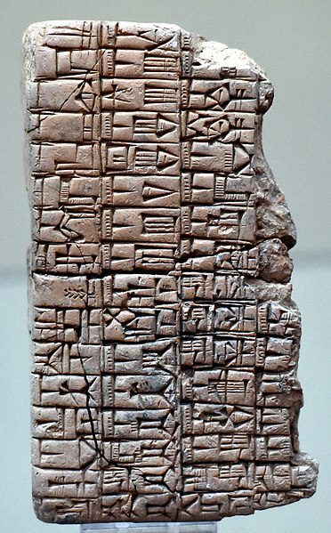

> Wikimedia Commons (cc)

An "algorithm" is simply a set of instructions that is to be followed in order.
The word came from the Persian mathematician al-Khwārizmī, author of
ninth-century book of techniques for doing mathematics by hand. Khwārizmī's book
"al-Jabr wa'l-Muqābala" where the word "al-Jabr" provided the source of our word
"algebra."

However, the earliest known algorithms predate the work of al-Khwārizmī.
A four-thousand-year-old Sumerian clay tablet found near Baghdad describes
a scheme for long division written in _cuneiform script_[^1].

"But algorithm are not confined to mathematics alone. When you cook bread from
a recipe, you're following an algorithm. When you knit a sweater from a pattern,
you're following an algorithm. When you put a sharp edge on a piece of flint by
executing a precise sequence of strikes with the end of an antler--a key step in
making fine stone tools--you're following an algorithm. Algorithms have been
a part of human technology ever since the Stone Age," wrote Brian Christian and
Tom Griffiths[^2].

``` {=html}
<div class="tldr rounded shadow-2xl">
  <h2>TL;DR</h2>
  <p>
    An "algorithm" is simply a set of instructions that is to be followed in
    order.
  </p>
</div>
```


[^1]: https://en.m.wikipedia.org/wiki/Babylonian_mathematics "Babylonian Mathematics"
[^2]: _Algorithms to Live By_ by Brian Christian and Tom Griffiths - Introduction
